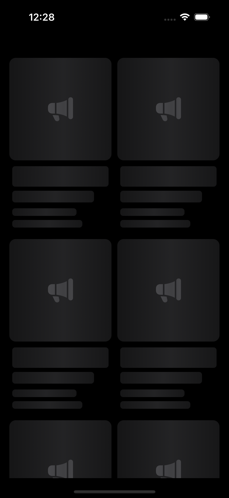
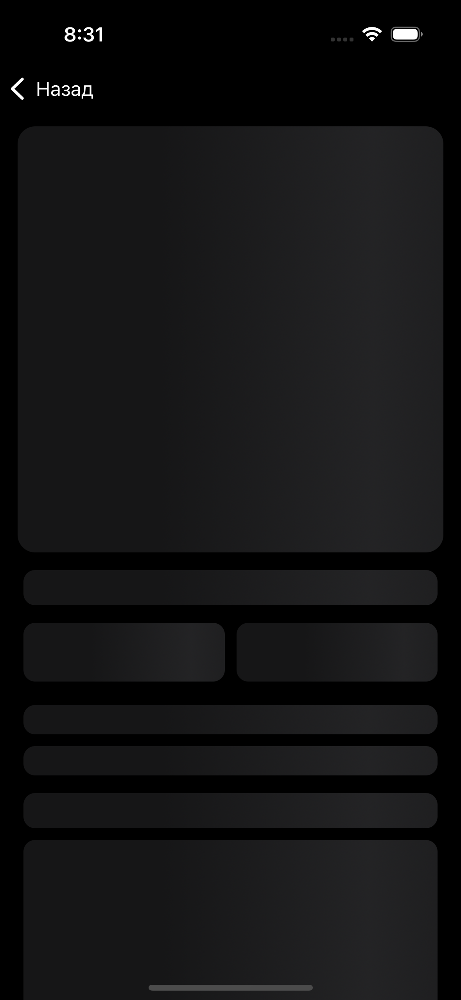

# Catalog iOS App - тестовое задание в Avito trainee

  
  
  

## Реализация:
- UIKit без сторибордов
- URLSession для запросов
- VIPER
- Без сторонних библиотек
- Кэширование изображений
- Поддержка iOS 14.0 и выше

## Состояние загрузки:

  
  
  

## Состояние ошибки:

  

## Инструкция по запуску:
- Версия Xcode 14.2 и выше
- Склонировать репозиторий
- Запустить ./CatalogApp/CatalogApp.xcodeproj